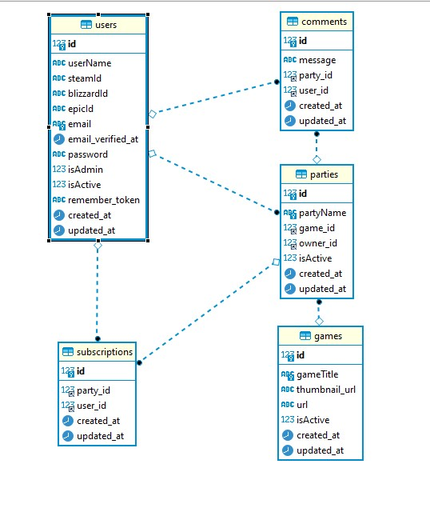

<p align="center"><a href="https://laravel.com" target="_blank"></a></p>

<p align="center">
<a name="top"></a>

<h1 align="center">
  <br> Game Chat Backend
</h1>

---

- [About](#about)   

- [Instructions](#instructions)

- [Screenshots](#images)

- [Tools](#tools)

- [Developers](#developers)

---
<a name="about"></a>
## About :speech_balloon:

Challenge from the Fullstack Developer Bootcamp at <a href="https://geekshubsacademy.com/">GeeksHubs Academy</a> where it's requested a backend api rest about a game chat app.

The backend can be tested locally and/or using the deployed version at Heroku: https://passportlaravelapp.herokuapp.com/


This Project has been done by [José Luis Aparicio](https://github.com/ApcarJo).

Starting date: July 12th 2021. <br>
Due date: July 18th 2021.

<a name="instructions"></a> 
## Instructions :clipboard: 

The first step is to clone the repository:

https://github.com/ApcarJo/laravelpassport

###To run the backend in local host:
Copy .env.example file on root directory and just change the name to .env and follow the next instruccions on terminal:
```
 php composer install
 php artisan migrate
 php artisan passport:install
 ```

Run the server
`php artisan serve`

### To run the backend from Heroku Deploy:
Copy .env.example file on root directory, rename to .env and configure the data to do the setup:
````
DB_CONNECTION=mysql
DB_HOST=j5zntocs2dn6c3fj.chr7pe7iynqr.eu-west-1.rds.amazonaws.com
DB_PORT=3306
DB_DATABASE=g0eaoixcaoz69iv8
DB_USERNAME=mkai32kbppd0ftsq
DB_PASSWORD=dctwaaw895z4g2t4`
````

Install dependencies

```
 php composer install
 php artisan migrate
 php artisan passport:install
 ```


<br>

On the other side, you will need to clone the Postman json that it can be found in the root directory as LARAVEL PASSPORT.postman_collection.json.


<a name="images"></a>
## Screenshots 📸

Database Diagram




<a name="tools"></a>
## Tools 🔧

PHP // Laravel // Composer // Passport // Heroku // GitHub // 


<a name="developers"></a>

## Developers ✍️

[José Luis Aparicio](https://github.com/ApcarJo) 


---

Thanks everyone in this GeeksHubs Academy season. This last project couldnt be possible without your help.

Things runned out of time to implement:
- Report comments
- Private chats
- 


[🔝](#top)